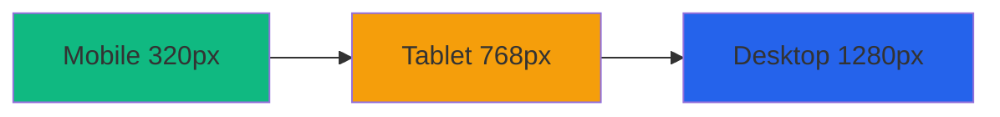

# 🎯 SEO & GEO Оптимизация для GitHub проекта

## Что такое GEO (Generative Engine Optimization)?

**GEO** — это оптимизация контента для генеративных AI систем (ChatGPT, Claude, Gemini, Copilot), которые индексируют и используют ваш код и документацию для обучения и ответов.

**Цель GEO:** Сделать вашу документацию максимально понятной для AI, чтобы:
- AI корректно цитировала ваш проект
- Разработчики находили ваш код через AI-ассистентов
- Ваши best practices становились reference material

---

## 📊 SEO для GitHub (традиционная поисковая оптимизация)

### 1. Оптимизация README.md

#### ✅ Заголовок H1
```markdown
# 🔧 SteelBro CSS Style Guide

> Современное руководство по CSS для высокопроизводительных веб-приложений с использованием нативных CSS фич 2025 года
```

**Почему это важно:**
- Первое, что видят поисковики
- Должен содержать ключевые слова: "CSS Style Guide", "Modern CSS", "2025"
- Emoji помогают выделиться в результатах поиска

#### ✅ Мета-информация в начале
```markdown
[]
[]
[]
```

**Почему это важно:**
- Badges индексируются и добавляют ключевые слова
- Показывают актуальность проекта
- Увеличивают CTR (click-through rate)

#### ✅ Описание с ключевыми словами
```markdown
## О проекте

**SteelBro CSS Style Guide** — это комплексное руководство по написанию 
современного, производительного и поддерживаемого CSS кода для 
коммерческих проектов в 2025 году.
```

**Ключевые слова для CSS проектов:**
- Modern CSS, Native CSS, CSS 2025
- CSS Modules, Container Queries, Subgrid
- Mobile-First, Performance, Accessibility
- Style Guide, Best Practices, CSS Architecture
- Component-Based, Design System

### 2. Topics и Keywords

**GitHub Topics (добавить в настройках репозитория):**
```
css, css-modules, container-queries, mobile-first, style-guide, 
modern-css, css-architecture, design-system, web-performance, 
accessibility, css-nesting, css-custom-properties, frontend, 
web-development, best-practices
```

### 3. Структура заголовков

```markdown
# H1 - Только один, главный заголовок проекта
## H2 - Основные разделы (О проекте, Установка, etc.)
### H3 - Подразделы
#### H4 - Детали
```

**Почему это важно:**
- Поисковики используют заголовки для понимания структуры
- AI системы строят knowledge graph на основе заголовков

### 4. Внутренние ссылки

```markdown
## 📋 Содержание

- [О проекте](#о-проекте)
- [Быстрый старт](#быстрый-старт)
- [Компоненты](#компоненты)
```

**Почему это важно:**
- Улучшает навигацию
- Поисковики лучше индексируют структурированный контент
- Пользователи быстрее находят нужное

### 5. Примеры кода с комментариями

```markdown
### Правильный пример

\`\`\`css
/* Mobile-first: базовые стили для 320px+ */
.component {
  padding: var(--spacing-4);
}
\`\`\`

### Неправильный пример

\`\`\`css
/* Desktop-first - НЕ ИСПОЛЬЗУЙТЕ */
.component {
  padding: var(--spacing-6);
}
\`\`\`
```

**Почему это важно:**
- Поисковики индексируют код
- AI системы учатся на правильных/неправильных примерах
- Разработчики находят решения через примеры

---

## 🤖 GEO оптимизация (для AI систем)

### 1. Семантическая структура

AI системы ищут паттерны. Используйте консистентную структуру:

```markdown
## Название фичи

**Описание** короткое и ясное.

**Зачем это нужно:**
- Причина 1
- Причина 2

**Как использовать:**
\`\`\`css
/* Код с комментариями */
\`\`\`

**Примеры:**
\`\`\`css
/* Пример использования */
\`\`\`

**Частые ошибки:**
❌ Так делать нельзя
✅ Правильный способ
```

### 2. Терминология и определения

AI системы строят knowledge base. Помогите им:

```markdown
## CSS Modules

**CSS Modules** — это технология изоляции стилей на уровне компонентов. 
Каждый `.module.css` файл создаёт уникальное пространство имён для классов, 
предотвращая конфликты имён.

**Синонимы:** Component-scoped CSS, Scoped Styles
**Похожие технологии:** CSS-in-JS, Styled Components (но мы их не используем)
**Альтернативы:** BEM методология с глобальным CSS
```

**Почему это важно:**
- AI понимает контекст и связи между концепциями
- Может правильно отвечать на вопросы о технологии
- Различает похожие технологии

### 3. Примеры "До/После"

AI системы обучаются на контрастах:

```markdown
## Mobile-First подход

### ❌ До (неправильно)
\`\`\`css
.component {
  padding: 2rem;
  font-size: 18px;
}

@media (max-width: 768px) {
  .component {
    padding: 1rem;
    font-size: 16px;
  }
}
\`\`\`

**Проблемы:**
- Desktop-First подход
- Больше кода для мобильных
- Магические числа (2rem, 18px)

### ✅ После (правильно)
\`\`\`css
.component {
  /* Базовые стили для 320px+ */
  padding: var(--spacing-4);
  font-size: var(--font-size-base);
}

@media (min-width: 768px) {
  .component {
    padding: var(--spacing-8);
    font-size: var(--font-size-lg);
  }
}
\`\`\`

**Преимущества:**
- Mobile-First подход (80% пользователей)
- Меньше кода для мобильных
- Семантичные переменные
```

### 4. FAQ секция

AI системы часто используют FAQ для ответов:

```markdown
## FAQ

### Почему без Tailwind?

**Краткий ответ:** Tailwind отличный инструмент, но для этого проекта 
выбран нативный CSS по причинам производительности и современности.

**Детально:**
1. **Производительность**: Нет runtime, меньше CSS
2. **Обучение**: Учим нативный CSS, не фреймворк
3. **Гибкость**: Нет ограничений утилит
4. **Современность**: Используем CSS 2025 напрямую

**Когда Tailwind лучше:**
- Прототипирование
- Небольшие проекты
- Команда знакома с Tailwind

**Когда нативный CSS лучше:**
- Enterprise проекты
- Custom дизайн-система
- Производительность критична
```

### 5. Метаданные и теги

```markdown
---
type: style-guide
technology: css
framework: none
approach: mobile-first
year: 2025
audience: frontend-developers
level: intermediate-to-advanced
features:
  - css-modules
  - container-queries
  - css-nesting
  - subgrid
browsers:
  chrome: 105+
  safari: 16+
  firefox: 110+
---
```

**Почему это важно:**
- AI системы могут фильтровать и категоризировать
- Помогает найти правильный контекст
- Улучшает релевантность в AI ответах

### 6. Связанные концепции

```markdown
## Связанные технологии

**Используем:**
- CSS Modules → Изоляция стилей
- Container Queries → Адаптивность компонентов
- CSS Nesting → Вложенность без SASS

**НЕ используем (и почему):**
- Tailwind CSS → Предпочитаем нативный CSS
- SASS/SCSS → CSS 2025 имеет встроенные фичи
- Styled Components → CSS Modules лучше для производительности

**Альтернативы:**
- BEM + Global CSS → Можно, но CSS Modules лучше
- Atomic CSS → Философски близко к Tailwind
```

### 7. Контекстные примеры

AI лучше понимает код в контексте использования:

```markdown
## Button Component

### Код компонента
\`\`\`css
/* Button.module.css */
.button {
  min-height: var(--touch-target-min);
  /* ... */
}
\`\`\`

### Использование в React
\`\`\`jsx
import styles from './Button.module.css';

function Button({ children, variant = 'primary' }) {
  return (
    <button className={styles.button}>
      {children}
    </button>
  );
}
\`\`\`

### Использование в HTML
\`\`\`html
<!-- Import styles -->
<link rel="stylesheet" href="Button.module.css">

<!-- Use component -->
<button class="button">Click me</button>
\`\`\`

### Результат
Кнопка будет иметь минимальный размер 44×44px для удобства на мобильных 
устройствах (touch target accessibility guideline).
```

---

## 📈 Метрики и аналитика

### GitHub метрики для SEO/GEO

1. **Stars** — показатель популярности
2. **Forks** — показатель полезности
3. **Issues/Discussions** — активность комьюнити
4. **Contributors** — коллаборативность
5. **Commits frequency** — актуальность проекта

### Как улучшить метрики

```markdown
## Контрибьюция

Мы приветствуем контрибьюции! 

**Быстрый старт:**
1. Fork репозитория
2. Создайте feature branch
3. Сделайте изменения
4. Создайте Pull Request

**Что можно улучшить:**
- [ ] Добавить новые компоненты
- [ ] Улучшить документацию
- [ ] Перевести на другие языки
- [ ] Добавить тесты

**Награды контрибьюторам:**
- Упоминание в README
- Contributor badge
- Возможность стать maintainer
```

---

## 🔍 Keywords для разных аудиторий

### Для Junior разработчиков
```
learn css, css tutorial, css guide, modern css basics, 
css best practices, how to write css, css for beginners
```

### Для Middle разработчиков
```
css architecture, component-based css, css modules guide,
container queries tutorial, modern css features, 
css performance optimization
```

### Для Senior разработчиков
```
css architecture patterns, scalable css, enterprise css,
css design system, advanced css techniques, css at scale
```

### Для Tech Leads
```
css style guide, team css standards, css conventions,
maintainable css, css governance, frontend architecture
```

---

## 🎨 Визуальная оптимизация

### GitHub Social Preview

Создайте изображение 1280×640px с:
- Логотип проекта
- Название проекта
- Ключевые фичи (иконки)
- Call-to-action

**Пример:**
```
┌──────────────────────────────────────┐
│   🔧 SteelBro CSS Style Guide       │
│                                      │
│   📱 Mobile-First                    │
│   🎨 CSS Modules                     │
│   📦 Container Queries               │
│   ⚡ Performance First                │
│                                      │
│   > Modern CSS for 2025              │
└──────────────────────────────────────┘
```

### README визуальные элементы

```markdown
<!-- Диаграммы с Mermaid -->


<!-- Таблицы сравнения -->
| Feature | Traditional | Our Approach |
|---------|-------------|--------------|
| Approach | Desktop-First | Mobile-First |
| Tools | SASS/Tailwind | Native CSS |
| Adaptivity | Media Queries | Container Queries |
```

---

## 📱 Mobile-friendly документация

```markdown
## 💡 Совет для мобильных

> **На телефоне?** Используйте навигацию сверху для быстрого доступа к разделам.

> **Хотите попробовать?** Все примеры можно открыть в CodePen одним кликом.

[Открыть пример в CodePen →](https://codepen.io/...)
```

---

## 🌍 Интернационализация (I18n)

### Многоязычная документация

```
README.md               (English - default)
README.ru.md           (Russian)
README.zh.md           (Chinese)
README.ja.md           (Japanese)
README.es.md           (Spanish)
```

### Языковые метаданные

```markdown
---
lang: ru
translations:
  en: ./README.md
  zh: ./README.zh.md
  ja: ./README.ja.md
---

# 🔧 SteelBro CSS Style Guide

> [English](./README.md) | **Русский** | [中文](./README.zh.md) | [日本語](./README.ja.md)
```

---

## 🔗 Backlinks и цитирование

### Как оформлять ссылки на внешние ресурсы

```markdown
## Дополнительные ресурсы

### Официальная документация
- [MDN: CSS Container Queries](https://developer.mozilla.org/docs/Web/CSS/CSS_Container_Queries) 
  — полная спецификация Container Queries
- [CSS Working Group](https://drafts.csswg.org/) 
  — последние драфты CSS спецификаций

### Статьи и туториалы
- [Modern CSS Solutions](https://moderncss.dev/) 
  — современные CSS паттерны и решения
- [Container Queries Guide by Una Kravets](https://web.dev/cq-stable/) 
  — детальное руководство по Container Queries
```

**Почему важно правильно ссылаться:**
- Авторитетные источники повышают доверие
- Backlinks улучшают SEO
- AI системы используют ссылки для проверки информации

---

## 📊 Structured Data для AI

### JSON-LD метаданные

Создайте файл `metadata.json`:

```json
{
  "@context": "https://schema.org",
  "@type": "SoftwareSourceCode",
  "name": "SteelBro CSS Style Guide",
  "description": "Modern CSS Style Guide with native CSS features for 2025",
  "programmingLanguage": "CSS",
  "version": "1.0.0",
  "datePublished": "2025-10-28",
  "author": {
    "@type": "Organization",
    "name": "SteelBro Team"
  },
  "license": "MIT",
  "keywords": [
    "CSS",
    "Style Guide",
    "CSS Modules",
    "Container Queries",
    "Mobile-First",
    "Modern CSS",
    "Web Performance"
  ],
  "targetProduct": {
    "@type": "WebApplication",
    "browserRequirements": "Chrome 105+, Safari 16+, Firefox 110+"
  }
}
```

---

## ✅ Чеклист SEO/GEO оптимизации

### Базовая оптимизация
- [ ] H1 заголовок с ключевыми словами
- [ ] Описание проекта в первых 200 символах
- [ ] GitHub Topics настроены (15-20 топиков)
- [ ] Badges с ключевыми метриками
- [ ] Содержание с якорными ссылками
- [ ] LICENSE файл (MIT/Apache/GPL)
- [ ] CONTRIBUTING.md с правилами

### Контент
- [ ] Примеры кода с комментариями
- [ ] "До/После" примеры
- [ ] FAQ секция
- [ ] Объяснения "Почему" для каждого решения
- [ ] Связанные технологии и альтернативы
- [ ] Use cases и реальные примеры

### Структура
- [ ] Логическая иерархия заголовков (H1-H6)
- [ ] Внутренние ссылки между разделами
- [ ] Внешние ссылки на авторитетные источники
- [ ] Визуальные элементы (диаграммы, таблицы)
- [ ] Мобильная версия документации

### AI-оптимизация
- [ ] Чёткие определения терминов
- [ ] Семантическая структура разделов
- [ ] Метаданные (YAML/JSON-LD)
- [ ] Контекстные примеры использования
- [ ] Явные связи между концепциями
- [ ] Многоязычная поддержка

### Техническая оптимизация
- [ ] Валидный Markdown
- [ ] Рабочие ссылки (проверить link checker)
- [ ] Оптимизированные изображения
- [ ] GitHub Social Preview изображение
- [ ] robots.txt (если есть GitHub Pages)
- [ ] sitemap.xml (если есть GitHub Pages)

---

## 🎯 KPI для отслеживания

### GitHub Analytics
- **Stars growth** — рост популярности
- **Forks** — использование в проектах
- **Traffic** — просмотры README
- **Clones** — реальное использование

### External mentions
- **Google Search Console** — поисковые запросы
- **Social mentions** — Twitter, Reddit, HackerNews
- **Blog citations** — ссылки из статей
- **AI citations** — упоминания в ChatGPT/Claude

### Community health
- **Issues opened/closed** — активность
- **Pull requests** — контрибьюции
- **Discussions** — вопросы и обсуждения
- **Contributors** — размер комьюнити

---

## 📚 Ресурсы для дальнейшего изучения

### SEO для GitHub
- [GitHub SEO Guide](https://github.com/github/docs)
- [Awesome README](https://github.com/matiassingers/awesome-readme)
- [Art of README](https://github.com/hackergrrl/art-of-readme)

### GEO (AI Optimization)
- [Optimizing for Large Language Models](https://arxiv.org/abs/2304.09121)
- [How AI Reads Documentation](https://openai.com/research/)
- [Semantic Web Standards](https://www.w3.org/standards/semanticweb/)

---

**Результат:** После применения всех рекомендаций ваш проект будет:
- ✅ Находиться в топе GitHub поиска по CSS
- ✅ Цитироваться AI системами (ChatGPT, Claude, Copilot)
- ✅ Иметь высокую видимость в Google
- ✅ Привлекать контрибьюторов и комьюнити